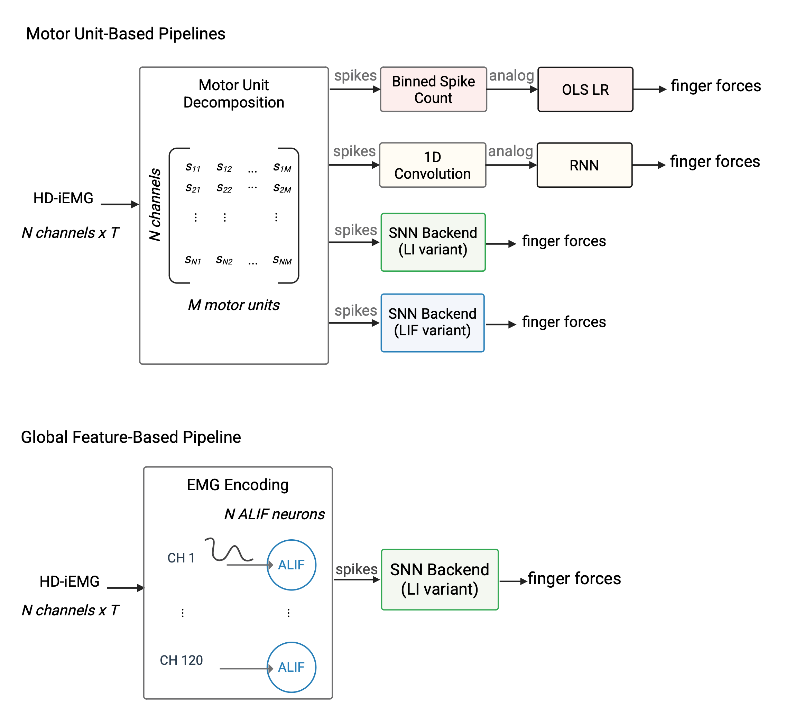

# Finger Force Regression with SNNs

Finger force regression from intramuscular EMG motor unit (MU) spike trains using Spiking Neural Networks (SNNs) and Recurrent Neural Networks (RNNs). The repository accompanies the manuscript and supports three main experiments: (i) SNN on clean MU spike trains, (ii) SNN on noisy MU spike trains, and (iii) SNN on encoded surface EMG spike trains.

Decomposition was carried using [A Particle Swarm Optimised Independence Estimator](https://github.com/AgneGris/swarm-contrastive-decomposition.git).
<p align="center">
  
</p>


## Table of Contents

- [📦 Installation](#-installation)
- [⚙️ Configuration](#️-configuration)
- [🧪 Experiments](#-experiments)
  - [Experiment 1 — SNN on clean MU spike trains](#experiment-1--snn-on-clean-mu-spike-trains)
  - [Experiment 2 — SNN on noisy MU spike trains](#experiment-2--snn-on-noisy-mu-spike-trains)
  - [Experiment 3 — SNN on encoded HD-iEMG EMG](#experiment-3--snn-on-encoded-surface-emg)
  - [RNN Baseline](#rnn-baseline)
  - [Regression Baseline — MU spike counts](#regression-baseline--mu-spike-counts)
- [🗂️ Project Structure](#️-project-structure)
- [📁 Output Files](#-output-files)

---

## 📦 Installation

> **Dependencies note:** This project uses two libraries included as git submodules with local modifications:
> - `snntorch` — a fork with custom ALIF neuron support (branch `alif_prev_release`)
> - `neurobench` — a fork pinned to v2.2.0 with local adaptations
>
> Both must be installed in editable mode from the submodule directories — **do not** install them from PyPI, as the PyPI versions lack the required modifications.

**Step 1 — Clone with submodules**

```bash
git clone --recurse-submodules <repo-url>
# If you already cloned without --recurse-submodules:
git submodule update --init --recursive
```

**Step 2 — Create the conda environment**

```bash
conda env create -f environment.yml
conda activate snn_test
```

**Step 3 — Install the submodules and the main package in editable mode**

> **Note:** `neurobench` depends on `llvmlite` (via `numba`), which has no pre-built wheel on some platforms and fails to compile from source via pip. Install it via conda first to use the pre-built binary:
> ```bash
> conda install -c conda-forge llvmlite numba
> ```

```bash
pip install -e ./snntorch
pip install -e ./neurobench
pip install -e .
```

**Step 4 — Verify**

```bash
python -c "import snntorch; import neurobench; import force_regression; print('OK')"
```

---

## ⚙️ Configuration

Edit [`configs/config.json`](configs/config.json) to point to your local data and output folders:

```json
{
  "root_dir": "/path/to/input_data",
  "root_results_dir": "/path/to/output_results"
}
```

All scripts use [Hydra](https://hydra.cc) for configuration management. The config tree lives in `configs/hydra/` and is composed at runtime:

```
configs/hydra/
├── snn.yaml          ← defaults list: task, training/snn, decoder_type/leaky, logging
├── rnn.yaml          ← defaults list: task, training/rnn, decoder_type/rnn, logging
├── task/task.yaml    ← subject, direction, MVC levels
├── training/         ← learning rate, epochs, batch size, etc.
├── decoder_type/     ← topology-specific parameters (tau, thresholds, filters)
└── logging/          ← W&B project name, use_wandb flag, logging frequency
```

To override a parameter from the command line:
```bash
python scripts/snn_on_mu.py task.subject=S2 training.lr=1e-3
```

---

## 🧪 Experiments

### Experiment 1 — SNN on clean MU spike trains

Trains and evaluates an SNN directly on motor unit spike trains from intramuscular EMG decomposition.

**Single run:**
```bash
python scripts/snn_on_mu.py
```

**Sweep over random seeds (W&B):**
```bash
wandb sweep configs/sweeps/wandb_sweep_seeds.yaml
wandb agent <sweep_id>
```

**Results compiled in:** [`notebooks/analysis/SNNResults.ipynb`](notebooks/analysis/SNNResults.ipynb)

---

### Experiment 2 — SNN on noisy MU spike trains

Trains on clean MU spike trains and evaluates under simulated decomposition errors (spike omissions/additions).

**Single run:**
```bash
python scripts/snn_on_noisy_mu.py
```

**Sweep over noise levels (W&B):**
```bash
wandb sweep configs/sweeps/wandb_sweep_noise.yaml
wandb agent <sweep_id>
```

**Results compiled in:** [`notebooks/analysis/NoiseResults.ipynb`](notebooks/analysis/NoiseResults.ipynb)

---

### Experiment 3 — SNN on encoded HD-iEMG

Trains an SNN on spike trains generated by encoding surface EMG signals.

> **Important:** Before running this script, ensure `configs/hydra/snn.yaml` sets `decoder_type` to `encoding`:
> ```yaml
> defaults:
>   - decoder_type: encoding
> ```
> The other scripts (`snn_on_mu.py`, `snn_on_noisy_mu.py`) use `decoder_type: leaky` or `decoder_type: spiking`. Using the wrong decoder type will silently load incorrect topology parameters.

**Single run:**
```bash
python scripts/snn_on_encodedEMG.py
```

**Sweep (W&B):**
```bash
wandb sweep configs/sweeps/wandb_sweep_enc.yaml
wandb agent <sweep_id>
```

**Results compiled in:**
- [`notebooks/analysis/ALIFResults.ipynb`](notebooks/analysis/ALIFResults.ipynb) — main performance results and prediction plots
- [`notebooks/analysis/ALIFSensitivity.ipynb`](notebooks/analysis/ALIFSensitivity.ipynb) — sensitivity analysis and encoding parameter sweeps

---

### RNN Baseline

Trains an RNN (ExponentialFilterRNN) on clean MU spike trains as a comparison model.

```bash
python scripts/rnn_on_mu.py
```

**Results compiled in:** [`notebooks/analysis/RNNResults.ipynb`](notebooks/analysis/RNNResults.ipynb)

---

### Regression Baseline — MU spike counts

Classical linear regression using binned MU spike counts as features.

- Clean data: [`notebooks/baselines/BaselineRegressionMUCount.ipynb`](notebooks/baselines/BaselineRegressionMUCount.ipynb)
- Noise experiment: [`notebooks/baselines/BaselineRegressionNoise.ipynb`](notebooks/baselines/BaselineRegressionNoise.ipynb)

---

## 🗂️ Project Structure

```
force_regression_snn/
├── scripts/                        # Entry-point training scripts
│   ├── snn_on_mu.py
│   ├── snn_on_noisy_mu.py
│   ├── snn_on_encodedEMG.py
│   └── rnn_on_mu.py
│
├── force_regression/               # Main package
│   ├── data/                       # Loaders, handlers, preprocessing, noise
│   ├── models/                     # SNN, RNN, linear regression
│   ├── training/                   # Training pipelines
│   ├── evaluation/                 # Metrics and results compilation
│   ├── plotting/                   # Visualization utilities
│   └── utils/                      # I/O, configuration helpers
│
├── configs/
│   ├── config.json                 # Local data/output paths
│   ├── hydra/                      # Hydra config tree
│   └── sweeps/                     # W&B sweep configs
│
└── notebooks/
    ├── analysis/                   # Results notebooks
    │   ├── SNNResults.ipynb
    │   ├── NoiseResults.ipynb
    │   ├── ALIFResults.ipynb
    │   ├── ALIFSensitivity.ipynb
    │   ├── RNNResults.ipynb
    │   ├── MUBaselineVsSNN.ipynb
    │   ├── ComputationalRessources.ipynb
    │   └── AnalysisWinSweep.ipynb
    ├── baselines/                  # Regression baseline notebooks
    │   ├── BaselineRegressionMUCount.ipynb
    │   └── BaselineRegressionNoise.ipynb
    └── visualization/              # Data exploration notebooks
        ├── VisualizeMUDecomposition.ipynb
        └── VisualizeNoiseOnMU.ipynb
```

---

## 📁 Output Files

Results are written to `root_results_dir/output_files` (set in `configs/config.json`), organised by subject and decoder type.

| Prefix | Contents |
|---|---|
| `y_df_` | Predicted and target force values per fold and finger |
| `y_dict_` | Full prediction dictionary (train/test, raw/smoothed) |
| `metrics_df_` | Performance metrics (RMSE, MAE, R²) |
| `trained_models_` | Fitted linear regression coefficients |
| `rec_rep_` | SNN state variables (membrane voltage, synaptic current, spikes) |

**SNN filename conventions:**
- `sinit_{float}` — learned synaptic time constant, initialised to `{float}`
- `tausyn_{float}` — fixed synaptic time constant set to `{float}`
